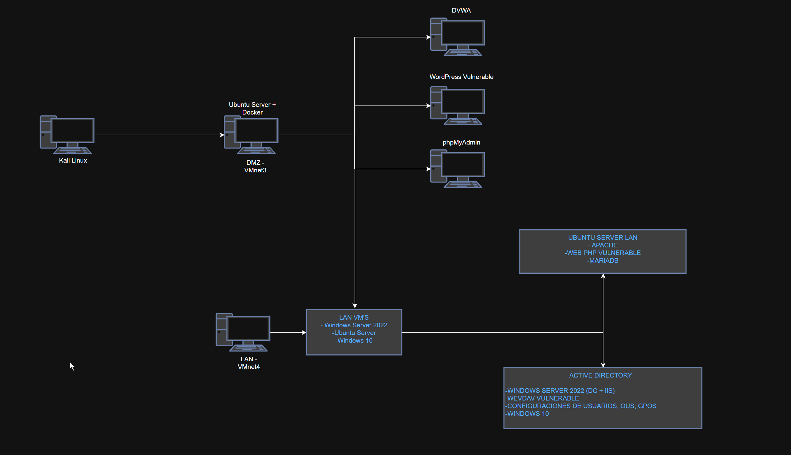
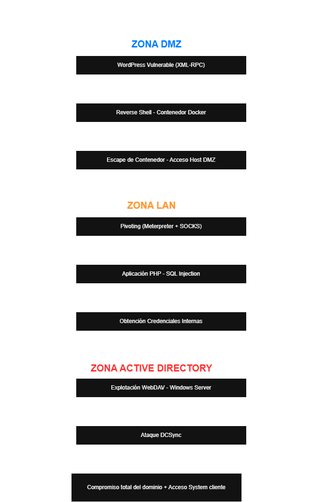

# Enterprise-security-lab-dmz-lan-ad

Simulación de infraestructura empresarial segmentada con explotación y fortificación de Active Directory

##  Arquitectura del Laboratorio

##  Flujo Simplificado de la Cadena de Ataque

# Laboratorio de Seguridad Empresarial  
## Segmentación DMZ – LAN – Active Directory  
### Explotación Controlada y Fortificación de Infraestructura

---

## Resumen Ejecutivo

Este proyecto consiste en el diseño, despliegue, explotación y posterior fortificación de una infraestructura empresarial segmentada, simulando un entorno real corporativo.

La arquitectura implementada incluye:

- Zona DMZ con servicios vulnerables en contenedores Docker.
- Red LAN interna con aplicación web vulnerable y base de datos.
- Dominio Active Directory en Windows Server 2022.
- Cliente Windows 10 unido al dominio.
- Máquina atacante Kali Linux.

Se ejecutó una cadena de ataque completa siguiendo metodología alineada con PTES, logrando el compromiso total del dominio Active Directory en un entorno controlado.

Posteriormente, se aplicaron medidas de mitigación y hardening siguiendo buenas prácticas de la industria (CIS Benchmarks, Microsoft Security Baselines, OWASP).

## Tecnologías Utilizadas

| Categoría | Tecnología |
|-----------|------------|
| Virtualización | VMware |
| Contenedores | Docker |
| Sistemas Linux | Ubuntu Server |
| Sistemas Windows | Windows Server 2022, Windows 10 |
| Directorio | Active Directory |
| Base de Datos | MySQL / MariaDB |
| Lenguajes | PHP |
| Herramientas Seguridad | Kali Linux, Impacket, Metasploit |

---

## Arquitectura de Red

La infraestructura se segmentó en:

###  DMZ
- WordPress vulnerable
- DVWA
- phpMyAdmin
- MySQL compartido
- Contenedores Docker mal configurados (intencionadamente)

###  LAN
- Aplicación PHP vulnerable
- MariaDB
- Servicio SSH
- Cliente Windows 10 en dominio

###  Dominio
- Windows Server 2022
- Active Directory
- DNS
- IIS + WebDAV (configurado de forma insegura)

---

## Cadena de Ataque (Resumen)

1. Explotación inicial en WordPress (XML-RPC)
2. Obtención de reverse shell en contenedor
3. Escape de contenedor Docker
4. Pivoting hacia red LAN
5. Explotación SQL Injection (Blind Time-Based)
6. Obtención de credenciales internas
7. Explotación WebDAV en servidor Windows
8. Ataque DCSync contra el controlador de dominio
9. Extracción de hashes NTLM
10. Acceso SYSTEM en cliente Windows 10

Resultado final: **Compromiso total del dominio en entorno aislado.**

---

## Medidas de Fortificación Implementadas

### Linux
- Eliminación de servicios vulnerables
- Configuración segura de MySQL
- Eliminación de CGI innecesario
- Refuerzo de permisos y servicios

### Docker
- Eliminación de modo privilegiado
- Eliminación de bind mounts inseguros
- Aislamiento de red
- Reducción de superficie de ataque

### Active Directory
- Políticas de contraseñas robustas
- Configuración de bloqueo de cuentas
- Deshabilitación de SMBv1
- Eliminación de WebDAV
- Reducción de privilegios administrativos
- Implementación de buenas prácticas de GPO

### Cliente Windows
- Restricción de privilegios
- Refuerzo de firewall
- Control de ejecución remota

---

## Impacto y Riesgo Empresarial

El proyecto demuestra cómo:

- La reutilización de credenciales amplifica el riesgo.
- La mala segmentación facilita el movimiento lateral.
- Un único servicio mal configurado puede comprometer todo el dominio.
- El impacto potencial incluye pérdida de datos, sanciones RGPD y daños reputacionales.

---

## Competencias Demostradas

- Diseño de arquitectura segmentada
- Seguridad en entornos Linux y Windows
- Explotación controlada de vulnerabilidades
- Técnicas de pivoting
- Seguridad en Active Directory
- Hardening de sistemas
- Análisis de impacto empresarial

---

---

## Lecciones Aprendidas

- La segmentación de red mal implementada no impide el movimiento lateral si existen credenciales reutilizadas.
- Docker mal configurado (modo privilegiado + bind mounts) puede convertirse en puerta de entrada al host.
- Un único servicio innecesario (WebDAV) puede ser suficiente para comprometer un dominio completo.
- Active Directory amplifica los errores de configuración debido a su modelo centralizado.
- La defensa no debe centrarse en bloquear exploits, sino en reducir superficie de ataque y privilegios.

Este laboratorio refuerza la importancia del principio de mínimo privilegio y la segmentación efectiva como pilares de la seguridad empresarial.

## Aviso Legal

Este laboratorio fue desarrollado en un entorno completamente aislado con fines educativos.
No se atacaron sistemas reales.
